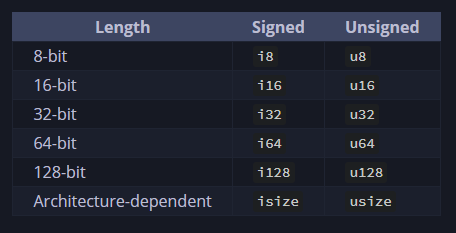
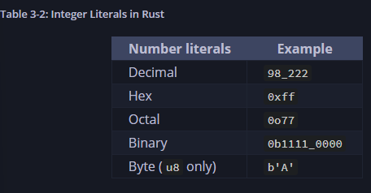
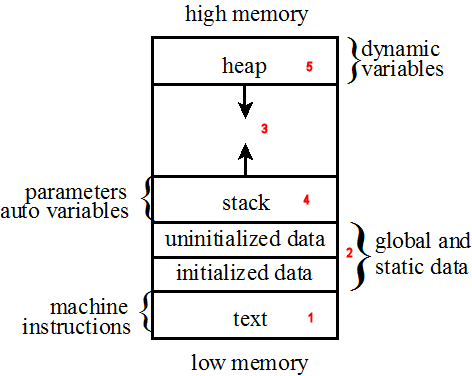

### Data Types
ในภาษา rust ทุก ๆ ตัวแปรที่เราใช้ในการเก็บข้อมูล จะมีการระบุชนิดของข้อมูลไว้ ซึ่งทำให้ระบบรู้ว่าควรจะทำงานกับข้อมูลนั้นอย่างไร โดยชนิดข้อมูลแบ่งออกเป็น 2 แบบ คือ
1. scalar
2. compound

ภาษา rust จะต้องกำหนดชนิดข้อมูลไว้ล่วงหน้า (ระหว่างคอมไพล์) โดยตัวคอมไพเลอร์สามารถระบุชนิดของข้อมูลของตัวแปรได้เอง โดยดูจากข้อมูลที่ตัวแปรเก็บ หรือการเรียกใช้งานตัวแปร

ตัวการทำงานจริง อาจมีการแปรงชนิดข้อมูลจากประเภท a ไปเป็นประเภท b ซึ่งเหตุการณ์นี้ เราจะต้องดักข้อผิดพลาดที่อาจเกิดขึ้น

    let guess: u32 = "42".parse().expect("Not a number!");

โดยจากชุดคำสั่งด้านบน หากเราไม่ระบุชนิดข้อมูลให้กับตัวแปร อาจเกิดข้อผิดพลาดขึ้นได้ ซึ่งเป็นข้อผิดพลาดที่ rust พยายามให้เราระบุชนิดของข้อมูลให้ชัดเจน

#### Scalar Types
ใช้สำหรับจัดเก็บข้อมูลแบบตัวเดียว โดยมีชนิดข้อมูลคือ
1. integer (จำนวนเต็ม)
2. floating-point (จำนวนเต็มพร้อมทศนิยม)
3. boolean (จริง/เท็จ)
4. character (ตัวอักษร)

#### Integer Type
จัดเก็บเลขจำนวนเต็ม โดยไม่มีเศษส่วน โดยจัดเก็บได้ตั้งแต่จำนวนเต็มลบถึงจำนวนเต็มบวก โดยการใช้พื้นที่เก็บข้อมูล จะมีความแตกต่างกันดังนี้

โดยความแตกต่างระหว่าง `i` กับ `u` คือ
- `i` ตัวเลขสามารถเป็นได้ทั้งจำนวนลบและบวก
- `u` ตัวเลขจะต้องเป็นจำนวนบวกเท่านั้น

<mark>ยิ่งใช้จำนวนบิตเยอะ ก็ยิ่งใช้แรมเยอะ และทำให้ cpu ต้องประมวลผลเยอะขึ้น</mark>

##### จำนวนบิตส่งผลกับการประมวลผลของ cpu ได้อย่างไร ?
สมมุติว่า cpu เป็นสถาปัตยกรรมแบบ 32 บิต, หมายความว่า การวนซ้ำ 1 รอบของหน่วยประมวล จะประมวลผลข้อมูลได้ขนาดใหญ่สุดที่ 32 บิต แต่หากมีการประมวลผล 64 บิต หน่วยประมวลผลจำเป็นต้องวนซ้ำการประมวลผลข้อมูลตัวนี้ 2 รอบ เพื่อให้การประมวลผลเสร็จสิ้น

เราสามารถระบุชนิดข้อมูลไว้หลังข้อมูลได้ เช่น `57u8`

เราสามารถใช้งาน `_` กับตัวเลขได้เพื่อให้อ่านง่ายขึ้น เช่น `1_000_000` ซึ่งอ่านง่ายกว่า `1000000`

หากไม่รู้ว่าค่าเริ่มต้นของชนิดข้อมูลควรเป็นอะไร แนะนำให้เริ่มต้นที่ `i32`

##### Integer Overflow
หากเราพยายามจัดเก็บข้อมูลที่มีขนาดใหญ่กว่าที่ชนิดข้อมูลสามารถเก็บได้ เช่น `i8` สามารถจัดเก็บข้อมูลได้ตั้งแต่ 0 ถึง 255 แต่เราพยายามเก็บ 256 ลงไป จะเก็บข้อผิดพลาด `integer overflow`

แต่หากเป็น `Release` ระบบจะใช้การวนรอบไปยังค่าต่ำสุดแทน เช่น 
- 256 กลายเป็น 0
- 257 กลายเป็น 1

#### Floating-Point Types
เป็นชนิดข้อมูลที่จัดเก็บเลขจำนวนเต็มพร้อมทศนิยม โดยสามารถระบุชนิดได้ผ่าน `f32` และ `f64` โดยชนิดข้อมูลเริ่มต้นจะใช้เป็น `f64` เนื่องจากเป็นสถาปัตยกรรมปัจจุบันของหน่วยประมวลผล

    let x = 2.0; // f64

    let y: f32 = 3.0; // f32

โดยแลขทศนิยมจะใช้มาตรฐาน `IEEE-754`

### Numeric Operations
Rust รองรับการดำเนินการคณิตศาสตร์พื้นฐาน ได้แก่
- บวก
- ลบ
- คูณ
- หาร
- หารเอาเศษ

แต่การหาร หากเป็นเลขจำนวนเต็ม จะปัดเศษไปยังเลขจำนวนเต็มที่ใกล้ที่สุด

    fn main() {
        // addition
        let sum = 5 + 10;

        // subtraction
        let difference = 95.5 - 4.3;

        // multiplication
        let product = 4 * 30;

        // division
        let quotient = 56.7 / 32.2;
        let truncated = -5 / 3; // result = -1

        // remainder
        let remainder = 43 % 5;
    }

### Boolean Type
ใช้จะเก็บค่า `true` หรือ `false` โดยขนาดของ boolean จะมี 1 byte

    fn main() {
        let t = true;

        let f: bool = false;
    }

โดยชนิดข้อมูลนี้ จะใช้กำเงื่อนไขต่าง ๆ

### Character Type
จัดเก็บตัวอักษรตัวเดียว เช่น `a`

    fn main() {
        let c = 'z';
        let z: char = 'Z';
        let heart_eyed_cat: char = '😊';
    }

โดยขนาดข้อมูลของ `char` คือ 4 byte โดยจะเก็บข้อมูลจริง ๆ เป็น unicode, ascii

### Compound Type
เป็นชนิดข้อมูลแบบผสม โดยสามารถเก็บได้หลายค่าในตัวแปรเดียว โดยมีที่นิยมใช้ คือ `tuples` และ `arrays`

#### Tuple type
ทูเพิล (tuple) ใช้สำหรับจัดเก็บข้อมูลจำนวนมากเข้าไว้ด้วยกัน แม้จะมีประเภทแตกต่างกัน โดยเมื่อประกาศแล้วจะมีความยาวคงที่ จะไม่สามารถเพิ่มหรือลดขนาดได้

    fn main() {
        let tup: (i32, f64, u8) = (500, 6.4, 1);
    }

โดยเราสามารถเข้าถึงข้อมูลด้านในทูเพิลได้ดังนี้

    fn main() {
        let tup = (500, 6.4, 1);

        let (x, y, z) = tup;

        println!("The value of y is: {y}");
    }

จากชุดคำสั่งดังกล่าว เราสร้างทูเพิลโดยเก็บข้อมูล 3 ตัว และเราจะแยก tup ออกเป็นสามตัวแปร คือ `x`, `y`, `z` โดยกระบวนการนี้เรียกว่า **การแยกโครงสร้าง (destructuring)** 

นอกจากนี้เรายังสามารถเข้าถึงข้อมูลในทูเพิลได้โดยตรงผ่าน `.`

    fn main() {
        let x: (i32, f64, u8) = (500, 6.4, 1);

        let five_hundred = x.0;

        let six_point_four = x.1;

        let one = x.2;
    }

ชุดคำสั่งดังกล่าว เป็นการเข้าถึงข้อมูลผ่านตำแหน่ง 

ทูเพิลที่ไม่มีค่าใด ๆ จะมีชื่อเรียกว่า `unit` โดยจะเขียนด้วยวงเล็บ `()`

*เพิ่มเติม* ทุก expression ใน rust จะต้องมีการคืนค่าเสมอ โดยค่าพื้นฐานที่สุดคือ `void` โดยจะใช้สัญลักษณ์ `()` แทน ซึ่ง `()` คือ *tuple ที่ว่างเปล่า* โดยเราจะใช้แทนสิ่งที่ *ไม่มีค่า* หรือก็คือ `void`

### Array Type
เป็นชนิดข้อมูลที่สามารถเก็บได้หลายค่าไว้ในที่เดียว โดยชนิดข้อมูลจะต้องเป็นชนิดเดียวกันทุกตัว และขนาดของอาเรย์จะคงที่

    fn main() {
        let a = [1, 2, 3, 4, 5];
    }

*อาเรย์จะจัดเก็บข้อมูลไว้บนสแต็ก*

อย่างไรก็ตาม อาร์เรย์มักถูกใช้กับกลุ่มของข้อมูลที่รู้จำนวนแน่นอน ไม่เปลี่ยนแปรงในภายหลัง เช่น รายชื่อเดือน 12 เดือน

    let months = ["January", "February", "March", "April", "May", "June", "July", "August", "September", "October", "November", "December"];

เราสามารถกำหนดค่าเริ่มต้นของอาร์เรย์โดยให้ทุกข้อมูลมีค่าเหมือนกันหมด โดยระบุข้อมูลเริ่มต้นและตามด้วย `;`

    let a = [3; 5]

ความหมาย คำหนดตัวแปรชื่อ `a` จัดเก็บสมาชิกทั้งหมด 5 ตัว โดยทุกตัวจะมีค่าเริ่มต้นที่ 3

    let a = [3, 3, 3, 3, 3];

    [value; length]

เราสามารถเข้าถึงข้อมูลที่อยู่ภายในอาร์เรย์ได้ผ่านการระบุตำแหน่ง

    fn main() {
        let a = [1, 2, 3, 4 , 5];

        let first = a[0];
        let second = a[1];
    }

### Invalid Array Element Access

    use std::io;
    fn main() {
        let a = [1, 2, 3, 4, 5];

        println!("Please enter an array index.");

        let mut index = String::new();

        io::stdin()
            .read_line(&mut index)
            .expect("Failed to read line");

        let index: usize = index
            .trim()
            .parse()
            .expect("Index entered was not a number");

        let element = a[index];

        println!("The value of the element at index {index} is: {element}");
    }

จากชุดคำสั่งด้านบน หากเราเข้าถึงตำแหน่งอาร์เรย์ที่มีข้อมูล เราจะได้รับข้อมูลในตำแหน่งที่ระบุ เช่น `a[0]` เราจะได้ข้อมูล `1` 

แต่หากเราเข้าถึงตำแหน่งที่ไม่มีในอาร์เรย์ จะเกิดข้อผิดพลาดดังนี้

    thread 'main' panicked at src/main.rs:19:19:
    index out of bounds: the len is 5 but the index is 10
    note: run with `RUST_BACKTRACE=1` environment variable to display a backtrace

โดยจะเป็นข้อผิดพลาดที่เกิดขึ้นระหว่างรันไทม์ โปรแกรมจะหยุดทำงานทันทีเมื่อเกิดข้อผิดพลาดดังกล่าว