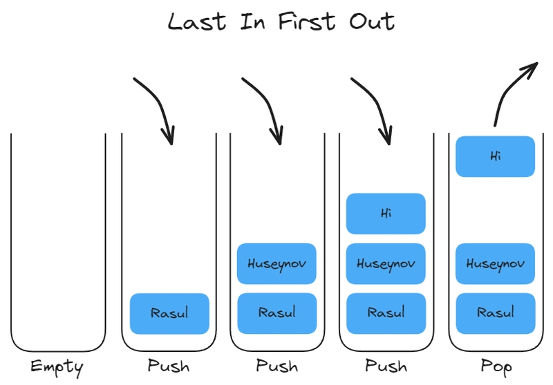
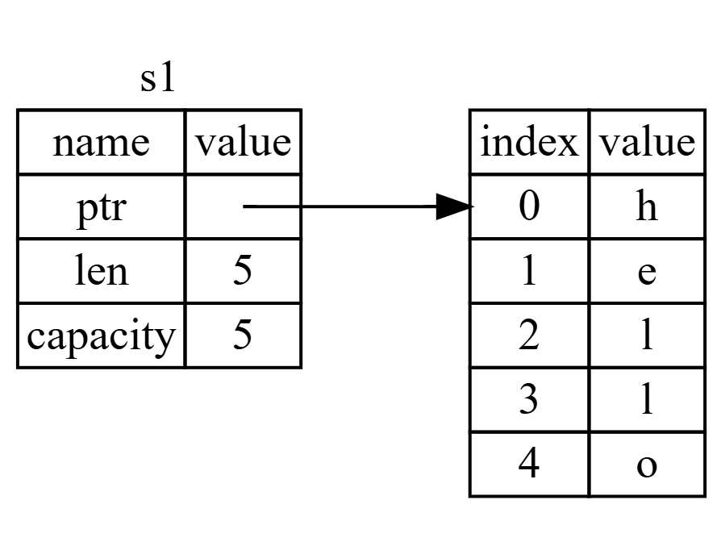
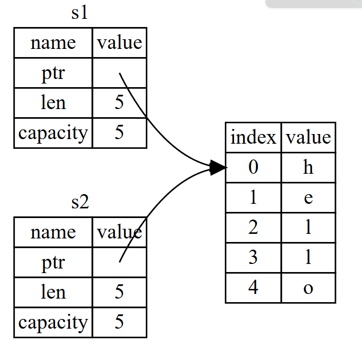
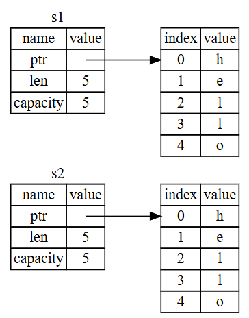
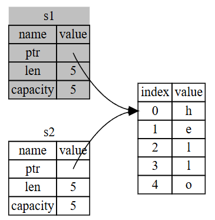

# Ownership
เป็นคุณสมบัติที่ทำให้เราสามารถจัดการหน่วยความจำได้อย่างปลอดภัย โดยไม่ต้องมี `garbage collector`

**Ownership** เป็นกฏที่ใช้ในการควบคุมหน่วยความจำของโปรแกรมในภาษา rust หากการเขียนโปรแกรมไม่เป็นไปตามกฏ โปรแกรมจะไม่สามารถคอมไพล์ได้

## Stack และ Heap
`stack` และ `heap` เป็นส่วนหนึ่งของหน่วยความจำที่โปรแกรมสามารถใช้งานได้ขณะทำงาน โดยทั้ง 2 ชนิดจะเก็บค่าที่แตกต่างกัน

### Stack
จัดเก็บค่าตามลำดับ โดยจะจัดเก็บในรูปแบบ *เข้าก่อน ออกทีหลัง (LIFO)*

การเพิ่มข้อมูลจะถูกเรียกว่า *push* และการดึงข้อมูลออกจะเรียกว่า *pop*

ข้อมูลที่จัดเก็บอยู่ใน `stack` จะต้องมีขนาดที่แน่นอนและคงที่ หากข้อมูลมีขนาดที่ไม่แน่นอน อาจเปลี่ยนแปรงได้ จะต้องเก็บไว้ใน `heap`

**สรุป** `stack` ใช้เก็บข้อมูลที่รู้ขนาดแน่นอนและคงที่ โดยจัดเก็บข้อมูลไว้ในรูปแบบ *last in first out*

### Heap
จัดเก็บข้อมูลจะเป็นระเบียบน้อยกว่าแบบ `stack` โดยการขอพื้นที่เก็บข้อมูลใน `heap` จะต้องมีการระบุขนาดของข้อมูลที่ต้องการ หลังจากนั้น `memory allocator` จะค้นหาหน่วยความจำที่มีพื้นที่มากพอสำหรับข้อมูลนั้น และทำเครื่องหมายว่าช่องนั้นถูกใช้งานแล้ว

กระบวนการนี้จะส่งคืนสิ่งที่เรียกว่า `pointer` ซึ่งเป็นที่อยู่ของพื้นที่จัดเก็บข้อมูลบน `heap`

#### กระบวนการ Allowcating
การนำข้อมูลไปไว้บน `heap` จะถูกเรียกว่า *Allowcating on the heap* หรือเรียกสั้น ๆ ว่า *Allowcating*

#### การเชื่อมโยงระหว่าง `stack` และ `heap`
`pointer` มีขนาดคงที่ เนื่องจากเรารู้ขนาดของ `pointer` ที่แน่นอน เราจึงจัดเก้บ `pointer` ไว้บน `stack`

เมื่อเราต้องการอ่านข้อมูลที่อยู่บน `heap` เราต้องอ่านข้อมูลที่อยู่ของข้อมูลใน `pointer` ก่อน แล้วจึงไปตามที่อยู่ที่ `pointer` จัดเก็บไว้ ขั้นตอนนี้ถูกเรียกว่า *Follow the pointer*

#### เปรียบเทียบกับร้านอาหาร
ลองนึกภาพการไปทานอาหารที่ร้าน
1. แจ้งจำนวนคน: เราบอกหนักงานว่ามี 5 คน (เปรียบเสมือนการขอจองพื้นที่บน heap)
2. พนักงานหาโต๊ะ: พนักงานหาโต๊ะที่ว่างนั่งได้ 5 คนและพาเราไปที่นั่น (เหมือน Allowcator ที่หาที่ว่างบน heap)
3. คนมาสาย: หากเพื่อนเรามาทีหลัง เขาสามารถถามพนักงานได้ว่า *กลุ่มของเราอยู่โต๊ะไหน* (เหมือนการใช้ Pointer เพื่อตามไปหาตำแหน่งข้อมูลที่จัดเก็บไว้)

## Stack และ Heap (ต่อ)
การใช้งาน `stack` จะเร็วกว่า `heap` เนื่องจากระบบไม่จำเป็นต้องค้นหาพื้นที่ ๆ ว่างพอสำหรับจัดเก็บข้อมูล และการเข้าถึงข้อมูล `heap` จะช้ากว่าเนื่องจากจำเป็นต้องไปหา `pointer` ที่อยู่ใน `stack` ก่อนจึงจะรู้ว่าข้อมูลที่จัดเก็บอยู่บน `heap` อยู่ที่ไหน

เมื่อชุดคำสั่งของเราเรียกใช้งานฟังก์ชัน ค่าต่าง ๆ ที่ถูกส่งเข้าไปในฟังก์ชัน (รวมถึง `pointer` ที่ชี้ข้อมูลบน `heap` ด้วย) และตัวแปรท้องถื่น (local variable) ของฟังก์ชันนั้น จะถูกนำไปวาง (push) ไว้บน `stack` และเมื่อทำงานเสร็จ ค่าเหล่านั้นจะถูกดึงออก (pop) ไปจาก `stack`

เมื่อฟังก์ชันทำงานจบ (ทำงานถึงเครื่องหมาย `}` ของฟังก์ชัน) มันจะลบข้อมูลทั้งหมดที่เกี่ยวข้องออกจาก `stack` ทันที ทำให้เหนื่อยความจำว่าง ฟังก์ชันอื่นสามารถใช้งานต่อได้ทันที

การคอยติดตามข้อมูลที่ถูกจัดเก็บไว้บน `heap` ช่วยลดปริมาณข้อมูลที่ซ้ำซ้อน และคอยลบข้อมูลที่ไม่ใช้แล้วออกจาก `heap` ทำให้เราสามารถมั่นใจได้ว่าพืิ้นที่จะถูกใช้งานอย่างมีประสิทธิภาพ และไม่ต้องกังวนเรื่อง `stack` และ `heap` จะเต็ม นี่คือเหตุผลที่เราต้องเรียนรู้ `Ownership`

### ปัญหาของโปรแกรมอื่นที่ไม่มี Ownership
1. **ใครใช้ข้อมูลไหนอยู่ ? (Tracking)** ในโปรแกรมใหญ่ๆ ถ้าไม่มีระบบจัดการที่ดี เราจะงงว่าข้อมูลตรงนี้ยังจำเป็นไหม? มีใครถือ Pointer นี้อยู่บ้าง? Ownership จะกำหนด "เจ้าของ" ที่ชัดเจนเพียงคนเดียว
2. **ข้อมูลซ้ำซ้อน (Dupplicate)** การก็อปปี้ข้อมูล ใช้พลังงานการประมวลผลสูง Ownership จึงเข้ามาช่วยจัดการเรื่องนี้ผ่านการส่งผ่านข้อมูล (move) หรือ ยืมข้อมูล (Borrow) แทนการก๊อปปี้
3. **หน่วยความจำเต็ม** นภาษาอย่าง C เราต้องลบข้อมูลบน Heap เอง (Manual Free) ถ้าลืมเครื่องก็ค้าง (Memory Leak) แต่ใน Rust เมื่อ "เจ้าของ" (Owner) หลุดออกนอกขอบเขต (Scope) ข้อมูลบน Heap จะถูกลบให้ อัตโนมัติ ทันที

## Ownership Rules
กฏการใช้งาน `ownership` มีดังนี้
1. ทุกข้อมูลจะต้องมีเจ้าของ
2. ข้อมูลจะมีเจ้าของได้เพียงคนเดียว
3. หากข้อมูลไม่มีเจ้าของแล้ว จะถูกลบออกจากหน่วยความจำทันที

## ขอบเขตตัวแปร (Variable Scope)
เป็นการกำหนดขอบเขตที่ตัวแปรสามารถถูกเข้าถึงและใช้งานได้

    {                                   // [เริ่มต้นขอบเขต] ตัวแปร s ยังไม่ถูกสร้าง ทำให้ไม่สามารถใช้งานได้
        let s: str = "Hello World";     // [ข้างในขอบเขต] สร้างตัวแปร s, หลังจากนี้ตัวแปร s จะสามารถใช้งานได้จนกว่าจะสิ้นสุดขอบเขต
    }                                   // [สิ้นสุดขอบเขค] ตัวแปร s จะไม่สามารถใช้งานได้อีกต่อไป และจะถูกล้างออกจากหน่วยความจำ

กล่าวสั้น ๆ ได้ว่า
- ตัวแปร s หากอยู่ในขอบเขต จะยังสามารถใช้งานได้
- เมื่ออยู่นอกขอบเขต จะไม่สามารถใช้งานได้อีกต่อไป

## The string type
`string` แตกต่างจากชนิดตัวแปรอื่น ๆ โดยจะจัดเก็บข้อมูลอยู่บน `heap` ไม่เหมือนกับชนิดข้อมูลอื่น ๆ เช่น `i32`,`i64` ที่จัดเก็บข้อมูลอยู่บน `stack` โดย rust แบ่งการเก็บข้อมูลบน `string` ออกเป็น 2 แบบ คือ
1. **String Literals (&str)** เป็นข้อความที่ถูกเขียนลงบนชุดคำสั่งตรง ๆ (Hard code) โดยจะมีขนาดตายตัว และไม่สามารถแก้ไขได้ (immutable)
2. **String Type (string)** เป็นชนิดข้อมูลที่ยืดหยุ่น สามารถปรับขนาดได้ แก้ไขภายหลังได้ (mutable) โดยจะเก็บข้อมูลไว้บน `heap` เหมาะสำหรับข้อมูลที่ไม่รู้ขนาดล่วงหน้า เช่น ข้อความที่ผู้ใช้จะพิมพ์

### การจัดการหน่วยความจำ
เพื่อให้ `string` ขยายขนาดได้ rust จำเป็นต้องจองพื้นที่บน `heap`
1. **การขอพื้นที่ (Allocate)** เมื่อเราใช้ `String::form("Hello World")` โปรแกรมจะขอพื้นที่จากหน่วยความจำขณะทำงาน (Runtime)'
2. **การคืนพื้นที่ (Free)**  ในภาษาอื่นอาจใช้งาน `Garbage Collection` ในการลบข้อมูลขยะ แต่ใน rust จะใช้งาน `ownership`

*เมื่อข้อมูลหลุดออกจากขอบเขค (out of scope) rust จะเรียกใช้งานฟังก์ชัน `drop` โดยอัตโนมัติ เพื่อคืนหน่วยความจำทันที*

### การปฏิสัมพันธ์ระหว่างข้อมูล (Move vs Clone)
นี่คือหัวใจสำคัญของ `ownership` เมื่อเรามีตัวแปร `string`
1. **Move (การย้าย)** เมื่อเราเขียน let s2 = s1; Rust จะไม่ก๊อปปี้ข้อมูลทั้งหมดบน Heap แต่จะก๊อปปี้แค่ "Pointer, ความยาว และความจุ" (ซึ่งอยู่บน Stack) ไปยัง s2 และ ยกเลิก (Invalidate) s1 ทันที เพื่อป้องกันปัญหา Double Free (การคืนหน่วยความจำซ้ำซ้อนเมื่อทั้งคู่หลุด Scope)
2. **Clone (การคัดลอก)** ถ้าเราต้องการก๊อปปี้ข้อมูลบน Heap จริงๆ (Deep Copy) เราต้องใช้เมธอด .clone() เช่น let s2 = s1.clone(); วิธีนี้จะทำให้ทั้ง s1 และ s2 ใช้งานได้ทั้งคู่ แต่จะใช้ทรัพยากรเครื่องมากกว่า

### Ownership กับการใช้งานฟังก์ชัน
1. การส่ง String เข้าไปในฟังก์ชัน จะมีพฤติกรรมเหมือนการ Assign ค่า คือการ Move สิทธิ์ความเป็นเจ้าของเข้าไปในฟังก์ชันนั้น ทำให้ตัวแปรเดิมในฟังก์ชันหลักใช้งานไม่ได้อีก
2. การส่งค่ากลับ (Return) จากฟังก์ชัน ก็คือการโอนย้าย Ownership ออกมายังตัวแปรที่รับค่า

## Meomry and Allocation
### ความแตกต่างของประเภทข้อมูลกับหน่วยความจำ
- **ข้อมูลขนาดคงที่ (เช่น String Literals)** ในกรณีของ `let s = "hello";` ตัวเนื้อหาจะถูกเก็บไว้ในไฟล์ executable โดยตรงตั้งแต่ตอนคอมไพล์ ทำให้มันทำงานได้เร็วและมีประสิทธิภาพสูง แต่ข้อเสียคือมันไม่สามารถเปลี่ยนแปลงขนาดได้
- **ข้อมูลที่ยืดหยุ่น (เช่น String type)** เพื่อให้รองรับข้อความที่เปลี่ยนแปลงขนาดได้หรือรับค่าจากผู้ใช้ในขณะรันโปรแกรม เราไม่สามารถจองพื้นที่ไว้ในตัวโปรแกรมล่วงหน้าได้ จึงต้องใช้หน่วยความจำบน Heap แทน

### ขั้นตอนการจัดการหน่วยความจำบน Heap
- **การขอพื้นที่ (Allocation)** เกิดขึ้นเมื่อเราเรียก `String::from` เพื่อขอพื้นที่จากหน่วยความจำในขณะรันโปรแกรม
- **การคืนพื้นที่ (Deallocation)** เมื่อใช้งานเสร็จ ต้องส่งคืนพื้นที่นั้นให้ระบบ

### วิธีการคืนหน่วยความจำ (Rust way)
Rust เลือกใช้งานวิธีที่แตกต่างจากภาษาอื่นในการคืนหน่วยความจำ
- **ไม่ใช่ Garbage Collector (GC)** ไม่มีระบบที่คอยเดินตรวจขยะในขณะรันโปรแกรมเหมือน Java หรือ Python
- **ไม่ใช่ Manual Memory Management** โปรแกรมเมอร์ไม่ต้องสั่ง free หรือ delete เองเหมือนใน C/C++ (ซึ่งเสี่ยงต่อการลืมลบ หรือลบซ้ำจนโปรแกรมพัง)
- **ระบบ Ownership** Rust จะคืนหน่วยความจำให้โดยอัตโนมัติ ทันทีที่ตัวแปรที่เป็น "เจ้าของ" (Owner) หลุดออกจาก Scope (ขอบเขตการทำงาน)

### ฟังก์ชัน Drop
เมื่อตัวแปรหลุดจาก Scope (`}`) Rust จะเรียกฟังก์ชันพิเศษที่ชื่อว่า `drop` โดยอัตโนมัติ ซึ่งภายในฟังก์ชันนี้เองคือที่ที่โค้ดสำหรับคืนหน่วยความจำทำงาน

**ประเด็นสำคัญ** รูปแบบนี้ดูเรียบง่ายแต่ทรงพลังมาก เพราะมันช่วยป้องกันข้อผิดพลาดทางหน่วยความจำ (Memory Safety) ได้ตั้งแต่ตอนคอมไพล์ โดยที่โปรแกรมเมอร์ไม่ต้องจำว่าต้องล้างหน่วยความจำเองที่ไหนและเมื่อไหร่

## Variables and Data Interacting with Move
ใน rust ตัวแปรหลายตัวสามารถโต้ตอบกับข้อมูลเดียวกันได้หลายวิธี

    let x: i32 = 5;
    let y: i32 = x;

ตัวแปร `x` ถูกสร้างขึ้นและเก็บค่า 5 ไว้ จากนั้นตัวแปร `y` ทำการคัดลองค่า 5 ในตัวแปร `x` โดยค่า 5 ของทั้งคู่จะถูกจัดเก็บไว้ใน `stack`

ตอนนี้มาดู `string`

    let s1 = String::from("Hello");
    let s2 = s1;

ดูเหมือนจะคล้ายกับตอนย้ายข้อมูลจาก `x` ไปที่ `y` แต่ไม่ใช่เลย

`string` ประกอบไปด้วย 3 ส่วน คือ
1. `ptr` จัดเก็บเนื้อหาของ `string`
2. `len` ความยาวของ `string` ที่ใช้งานอยู่
3. `capacity` ความจุของ `string` ที่ระบบจัดสรรให้

โดยทั้ง 3 ส่วนจะเก็บไว้ใน `stack` ส่วนเนื่อหาของ `string` จะถูกเก็บไว้ใน `heap` (ด้านขวาในรูป)

โดยการที่เราสั่งให้ `s2 = s1` จะเป็นการคัดลอกข้อมูลของ `string` ที่อยู่บน `stack` (ptr, len, capacity) และจะใช้คำแหน่งของเนื้อใน `string` เป็นตำแหน่วงเดียวกันกับ s1 ตามภาพตัวอย่าง

โดยจะคัดลอกเฉพาะข้อมูลที่อยู่ใน `stack` เนื่องจากหากตัดลอกข้อมูลที่อยู่ใน `heap` ด้วยจะสิ้นเปลืองและใช้พลังงานสูงมาก เนื่องจากมักจะเป็นข้อมูลขนาดใหญ่

**Double free error** เป็นการที่โปรแกรมพยายามปล่อยปล่อยหน่วยความจำจากตัวแปร 2 ตัวในที่เดียวกัน ทำให้เกิดข้อผิดพลาดดังกล่าวขึ้น

โดยในภาษา rust เพื่อให้สามารถมั่นใจได้ว่าจะไม่เกิดข้อผิดพลาดนี้ขึ้น หลังจากใช้คำสั่ง `let s2 = s1` ตัวแปร `s1` จะไม่สามารถใช้ได้อีกต่อไป

ในภาษาโปรแกรมอื่นจะมีวิ่งที่คล้ายกัน เรียกว่า `shallow copy` แต่สิ่งที่แตกต่างคือวิธีการนี้จะทำให้ตัวแปร `s1` ยังคงสามารถใช้งานได้ (ทำให้อาจเกิดข้อผิิดพลาดขึ้น แต่เขียนโปรแกรมง่ายมากขึ้น) ซึ่งใน rust เราจะเรียกวิธีการนี้ว่า `move`

เพียงเท่านี้ ก็จะมี `s2` เท่านั้นที่สามารถใช้งานได้ และเมื่อการทำงานจบขอบเขต ข้อมูลก็จะถูกปลดปล่อย

## Scope and Assignment

